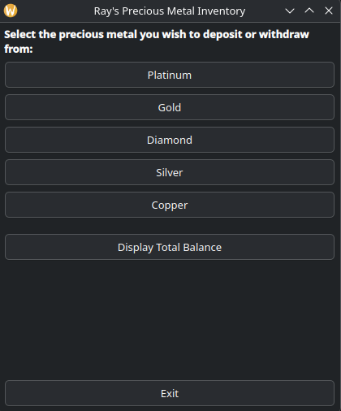

# Inventory Management System

#### A program to take user input to maintain an inventory of their precious metals. The user will be prompted to choose a precious metal to deposit or withdraw from. The max capacity for each metal is 100. They are allowed to deposit in decimal points. Input validation is also put in place to protect against wrong numbers or letters. It is a beginner program I wrote as I get back into using C++ again. It now has two versions: a CLI version and a GUI version built with Qt.

---

<br>

**CLI**


**GUI**



---

## CLI Version

#### Located in `cli/`. This program has two ways in which it can be ran (three if you manually do it). Makefile and shell script. Note that if you use the make file, you should clean it up to protect against any old executibles. If any issues arise with the shell script not executing, simply chmod it.

### Using Makefile

#### 1. Run inside the terminal
```bash
cd cli
make
```

#### 2. then to clean up once done
```bash
make clean
```

### Using shell script

#### Run inside the terminal
```bash
cd cli
./run.sh
```

---

## GUI Version

#### Located in `gui/`. Same core logic and validation rules as the CLI version, just with buttons and windows instead of typing numbers into a terminal. The amount field also shows the system's rules directly on screen and explains specifically why an entry was rejected (empty, non-numeric, over the limit, etc.) instead of one generic error message. Built using Qt6 and CMake instead of a Makefile.

### Requirements

#### You need Qt6 (Widgets module), CMake, and a C++17 compiler installed first.

**Fedora:**
```bash
sudo dnf install qt6-qtbase-devel cmake gcc-c++
```

**Ubuntu/Debian:**
```bash
sudo apt install qt6-base-dev cmake build-essential
```

**Mac (Homebrew):**
```bash
brew install qt cmake
```

**Windows:**
#### Use the Qt Online Installer (qt.io) and select Qt 6.x with the MinGW or MSVC toolchain. Install CMake separately if not already on your system.

### Building and Running

#### This has two ways it can be ran (three if you manually do it). CMake by hand, or the run script. The run script builds, runs, and cleans up the build/ folder automatically afterward -- even if you Ctrl+C out of it.

### Using CMake manually

#### 1. Run inside the terminal
```bash
cd gui
mkdir build
cd build
cmake ..
cmake --build .
```

#### 2. then to run
```bash
./InventoryGUI
```

#### 3. then to clean up once done
```bash
rm -rf build
```

### Using the run script

#### Run inside the terminal. This builds into gui/build, runs the program, and deletes gui/build automatically when you're done (or if you interrupt it). If it doesn't execute, chmod it.
```bash
cd gui
./run_gui.sh
```